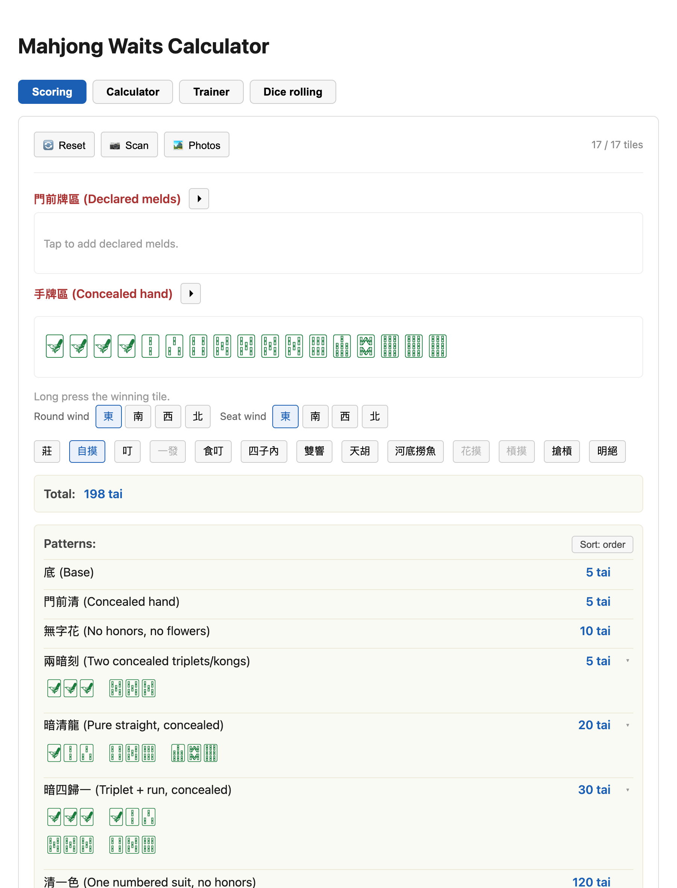
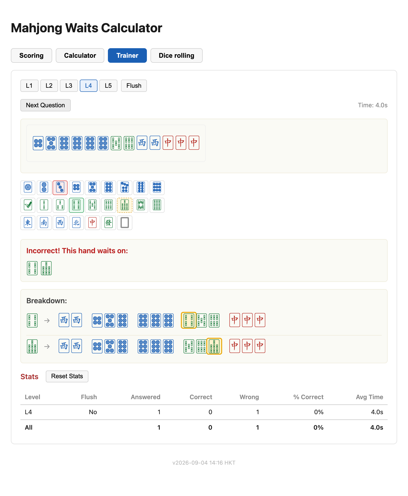
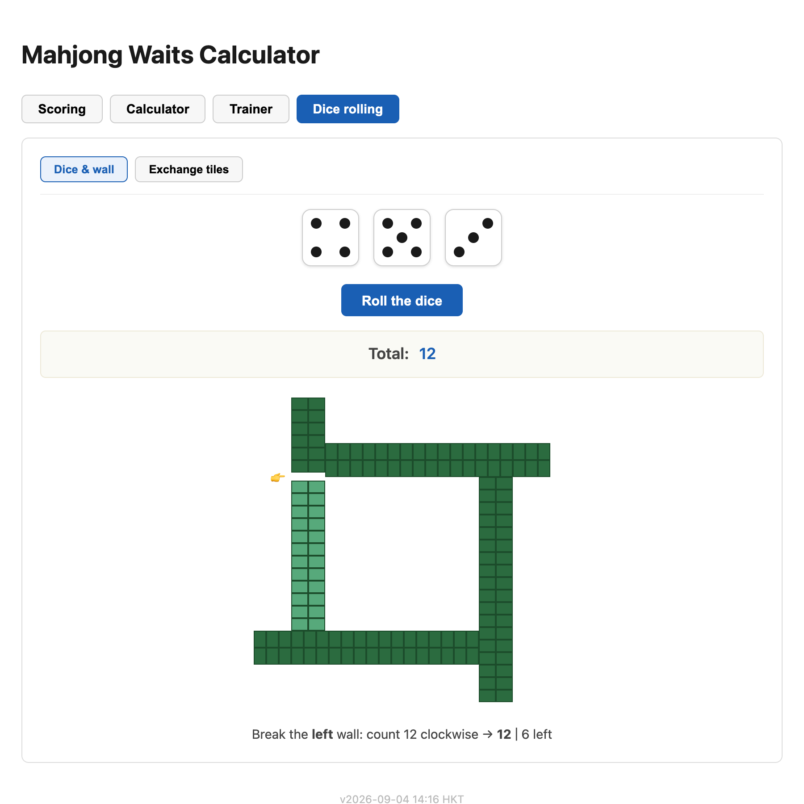

# mjwaits

A browser toolkit for Taiwanese (16-tile) Mahjong. It started as a waits calculator — build a
hand, see what completes it and which discard gives the best odds — and has grown four tabs:

- **Scoring** — score a finished hand against a concrete house tai (番) list (~140 patterns).
- **Calculator** — the original: waits, shanten, joker resolution, and discard analysis.
- **Trainer** — a timed quiz for drilling waits recognition.
- **Dice rolling** — roll for the wall, and see exactly where it breaks.

Everything runs client-side, including the camera tile scanner. No hand ever leaves the browser.

**Live app: [app.kevinlhc.com/mjwaits](https://app.kevinlhc.com/mjwaits/)**



## Scoring calculator (tai / 番)

The Scoring tab (the default on load) scores a **complete** winning hand against one concrete
house tai list — nearly 140 patterns, built up one at a time rather than as a configurable
ruleset. It totals tai; there's no point/currency conversion yet.

### Entering the hand

The input models the table, not a text string:

- **門前牌區 (Declared melds)** — everything laid in front of you. Pick a kind — 上 (chow), 碰
  (pung), 暗槓 (concealed kong), 明槓 (exposed kong) — then tap a tile to drop that meld in; a
  separate collapsible sub-picker adds bonus tiles (flowers / seasons). Invalid run starts grey
  out, and the picker disables itself once five melds are declared.
- **手牌區 (Concealed hand)** — the tiles still in hand, as a plain multiset the scorer
  decomposes. **Long-press** a concealed tile to mark it as the **食胡 tile** (the one that
  completed the hand); several patterns depend on whether the completing meld was self-drawn or
  claimed off a discard.
- **Round wind** and **seat wind** (東 / 南 / 西 / 北, round shown first), a **莊** (dealer)
  button that steps up a 連莊 streak with +/−, a **自摸** (self-draw) toggle, and a strip of
  situational-declaration buttons that the tiles alone can't show. Most cycle on each tap:
  **叮 → 天叮 → 地叮** (riichi and its upgrades) with **一發** and **食叮** alongside;
  **四子內 / 七子內 / 十子內** (won within the first N discards); **雙響 / 三響** (multiple
  winners on one discard); **天胡 / 地胡 / 人胡**; **河底撈魚 / 海底撈月 / 海底撈月(一筒)** (won
  on the very last tile); count-based **花摸 / 槓摸 / 搶槓** (×N, each capped at the bonus tiles
  or kongs actually present); and a shared **明絕 / 絕絕**. These buttons wire each other up the
  way the rules interact — e.g. 自摸 auto-activates with 花摸 / 槓摸, any last-tile win, or 天胡,
  and is mutually exclusive with 搶槓 / 雙響 / 三響 / 地胡 / 食叮.

**Reset** clears the hand, the winds, and every one of these toggles, and cancels a scan that's
still running.

### Scoring

Special hands — 十三么 (Thirteen Orphans), 嚦咕嚦咕 (Eight Pairs), 十六不搭 (Sixteen Unrelated) —
are detected up front and scored by their own dedicated logic. Everything else is run through
**every** valid meld/pair decomposition of the hand, and the reading with the **highest total
tai** wins — which decomposition you pick genuinely changes the score. When a pattern lists an
exclusion, a matching "bigger" pattern suppresses the smaller one it names; unrelated patterns
stack freely, and several (清龍, 步步高, 四歸, …) fire more than once when a segment repeats
(the count is the product of the repeated segments' meld counts). A hand that is simultaneously
a valid Eight Pairs and a valid ordinary hand (嚦咕雙食) is shown scored both ways.

The result is the **tai total** plus a **matched-pattern list**: each row is a pattern name and
its tai, and tapping a row expands it to the exact tiles behind that pattern — one sub-row per
stacking instance. A sort toggle cycles the list through check-order / tai ↓ / tai ↑, and
pressing and holding a row lights up its tiles in the DECLARED / CONCEALED display below.

### Projected scores

When the concealed hand is exactly one tile short of complete, the tab reuses the waits
calculator on it and shows, per wait, the score the whole hand would land on if that tile
completed it (each wait taken as its own 食胡 tile) — a collapsible list, sortable by score or by
tile. Kept deliberately narrow: no jokers, no concealed kongs.

[`docs/scoring-rules.md`](docs/scoring-rules.md) is the full reference — every tai value, its
criteria and exclusions, the 明 / 暗 (open / concealed) distinction, and the duplicate-instance
counting rules — kept in sync with the code.

## Calculator


### Hand input

- **Tap tiles** on the picker, or **type algebraic notation** directly
  (e.g. `123456789m111z11t22b`) — the two stay in sync.
- Suits: `m` (man / characters), `t` (pin / circles), `b` (sou / bamboo), `z` (honors, 1–7 for
  East / South / West / North / Red / Green / White), `j` (joker).
- **Sort** toggle: on, new tiles are kept in sorted order as you add them; off, they stay in the
  order you entered them — and toggling back off restores that original order.
- A 4-copies-per-kind cap is enforced automatically (jokers excluded — see below).

### Waits

- Enter a hand at any checkpoint size (1, 4, 7, 10, 13, 16 tiles) to see what completes it.
- A **universal wait** is flagged explicitly when any of the 34 tile kinds would complete the hand.
- Remaining copies of each waiting tile are always shown (4 minus what's already in hand), plus a
  running total across all waits.
- **Breakdown** shows the exact meld/pair decomposition for each wait, completing tile
  highlighted; a small `↔` button (once Breakdown is on) switches between pair-first and
  tile-order display. A hand genuinely ambiguous between two shapes (e.g. a standard hand that's
  also valid Eight Pairs) shows every valid reading, not just one.

### Shanten

A full numeric shanten count — not just tenpai / not-tenpai — for the minimum number of
discard+draw exchanges needed to reach tenpai. Covers the standard meld+pair shape plus Eight
Pairs and Sixteen Unrelated Tiles, and shows as a badge next to the hand.

### Discard analysis

Two related tools, depending on where you are in the hand:


- **Discard efficiency** — at any checkpoint size that *isn't* tenpai, every discard is ranked by
  a weighted score. For each one, a two-step lookahead lists every useful follow-up draw (with
  copies remaining) and what the hand would then wait on (with its own remaining count). This
  surfaces the discard with the best actual odds of a win, not just whichever reaches tenpai
  fastest.
- **Discard options** — one tile past a checkpoint (i.e. right after drawing), each distinct
  discard is shown with what it leaves you: tenpai and its waits, or a shanten value and which
  draws would improve it, each with remaining-copy counts. A winning hand is called out as such —
  and, with Breakdown on, still shows its full decomposition plus what discarding anyway would
  leave you waiting on.

### Jokers (🀪)


Jokers are wildcards standing in for any tile. Add any number to a hand and the calculator works
out every wait they unlock, plus what each joker resolves to for a given wait — using a
wildcard-budget search rather than brute-forcing every substitution, so it stays fast with many
jokers in hand. With Breakdown on, the tile a joker stands in for is highlighted in purple within
its meld/pair group, distinct from the amber highlight on the tile you'd actually draw. (Discard
analysis isn't available yet for hands containing jokers.)

### Special hands


Beyond the standard five-melds-plus-a-pair shape, the calculator recognizes:

- **Thirteen Orphans** — all 13 terminal/honor kinds, one doubled as the pair, plus one ordinary meld.
- **Eight Pairs ("Liguligu")** — seven pairs plus one tripled pair (a full quad counts as two pairs).
- **Sixteen Unrelated Tiles** — all 7 honors plus 3 mutually "unrelated" ranks from each of
  man/pin/sou (no two close enough to ever share a chow), plus one tile doubling any of them for
  the pair.

Breakdown mode understands all three: Thirteen Orphans groups the pair, the 12 remaining singles,
and the extra meld; Eight Pairs shows the tripled kind first, then the other seven pairs;
Sixteen Unrelated shows the pair and the other 15 singles.

### Camera scan (📷)

Point a camera at a hand (or pick a photo) and have the tiles filled in automatically. Detection
runs entirely in-browser — a YOLOv8n (nano) model quantized to INT8 ONNX (3.4 MB), run via
[onnxruntime-web](https://github.com/microsoft/onnxruntime) (WASM). No image is uploaded anywhere.

The Scan button opens the camera directly (there's a separate 🏞️ Photos button for an existing
shot). You then drag to crop out anything that isn't the hand, with a rotate control for sideways
photos; overlapping duplicate detections are dropped with non-max suppression, and a review step
draws a box over each detected tile (bonus tiles like flowers/seasons are boxed but greyed out
and excluded) before it replaces your hand. The **Scoring** tab uses the same scanner with two
crops — one for the 手牌區 concealed pile, one for the 門前牌區 declared pile — each labelled and
read back into the right region; if a scan of a Scoring hand comes back a genuine complete hand,
it's applied straight away with a persistent "✅ Hand applied from scan" banner and an **Adjust**
button back to the crop.

The model was trained on a merged dataset combining
[MahjongVis](https://github.com/Andy8647/MahjongVis) (MIT) and
[MJOD-2136](https://github.com/jaheel/MJOD-2136) (CC BY-NC-SA) across 42 tile classes (the 34
mjwaits recognizes plus 8 bonus-tile classes), then fine-tuned on real photos of a physical set
to close the gap between the training data's tile designs and a visitor's actual tiles. On the
full validation split the deployed checkpoint scores mAP50 0.944 / mAP50-95 0.752 / precision
0.973 / recall 0.913. See [training/README.md](training/README.md) for the full pipeline.

## Trainer



A timed quiz for practicing waits recognition. Each question is a randomly generated hand at one
of five levels — Level 1 is 4 tiles (1 meld + pair), Level 5 the full 16-tile tenpai size —
guaranteed to have at least one wait. The answer picker only shows suits actually present in the
question, since a wait can never come from a suit that isn't already there. Mark your guess, then
submit: the picker flags each pick as a correct hit, a wrong guess, or a wait you missed, and a
full breakdown (same as the Calculator's) shows how each real wait completes the hand. **Flush
mode** restricts every generated hand to one random suit for extra difficulty.

A per-question timer runs and freezes at submit. Results accumulate into a stats table broken
down by level and flush mode — answered, correct, wrong, % correct, average time — with an
overall row and a Reset Stats button. Stats survive switching tabs and back.

## Dice rolling



Two sub-tabs:

- **Dice & wall** — three tappable d6 (tap a die to nudge its face, or roll for an animated
  tumble that settles on one result). The total sits in a box tinted green for a three-of-a-kind
  and red for a 1-2-3. Below it the full built wall is drawn as four 2×18 tile-back bars in a
  pinwheel offset, and the dice sum breaks it: the app counts round to the right seat, marks the
  opening with a 👉, and captions which side is broken and how many stacks are counted off.
- **Exchange tiles** — a two-die roller for the pre-deal exchange. One die (a labelled "Round"
  box) picks a round 1–3, the other ("Tiles") a count with a floor of 3, and it shows Round,
  Tiles, and their product.

## Notation reference

```
123456789m111z11t22b   5 melds + a pair
1278m555t111333777z    mixed suits and honors
jjjj                   4 jokers, no rank needed
```

Digits before a suit letter are that many tiles of that suit; jokers are written as a run of bare
`j` characters since they have no rank.

## Development

```bash
npm install
npm run dev      # start the dev server (http://localhost:5173/mjwaits/)
npm test         # run the test suite (vitest)
npm run lint     # oxlint
npm run build    # typecheck + production build
```

The core engine (parsing, shanten, waits, joker resolution, discard analysis) lives in
[`src/lib/mahjong.ts`](src/lib/mahjong.ts), covered by an extensive suite in
[`src/lib/mahjong.test.ts`](src/lib/mahjong.test.ts) including brute-force cross-validation for
the trickier joker and shanten logic. Trainer question generation is in
[`src/lib/trainer.ts`](src/lib/trainer.ts) with property-based checks across all levels and flush
mode. The scoring engine — notation parsing, the all-decompositions search, and the `PATTERNS`
tai list — is in [`src/lib/scoring.ts`](src/lib/scoring.ts), tested in
[`src/lib/scoring.test.ts`](src/lib/scoring.test.ts); see
[`docs/scoring-rules.md`](docs/scoring-rules.md) for what each pattern does. The client-side tile
detector (letterboxing, ONNX inference, non-max suppression) is in
[`src/lib/vision.ts`](src/lib/vision.ts).

The README screenshots are regenerated from a running dev server with
[`scripts/shoot-readme-screenshots.mjs`](scripts/shoot-readme-screenshots.mjs) (needs
`npm i puppeteer-core --no-save` and a local Google Chrome).

Built with React, TypeScript, and Vite; deployed to GitHub Pages via GitHub Actions on every push
to `main`.

See [ROADMAP.md](ROADMAP.md) for future ideas (a live camera viewfinder, extending joker
resolution into shanten and discard analysis, point/currency conversion for scoring).
