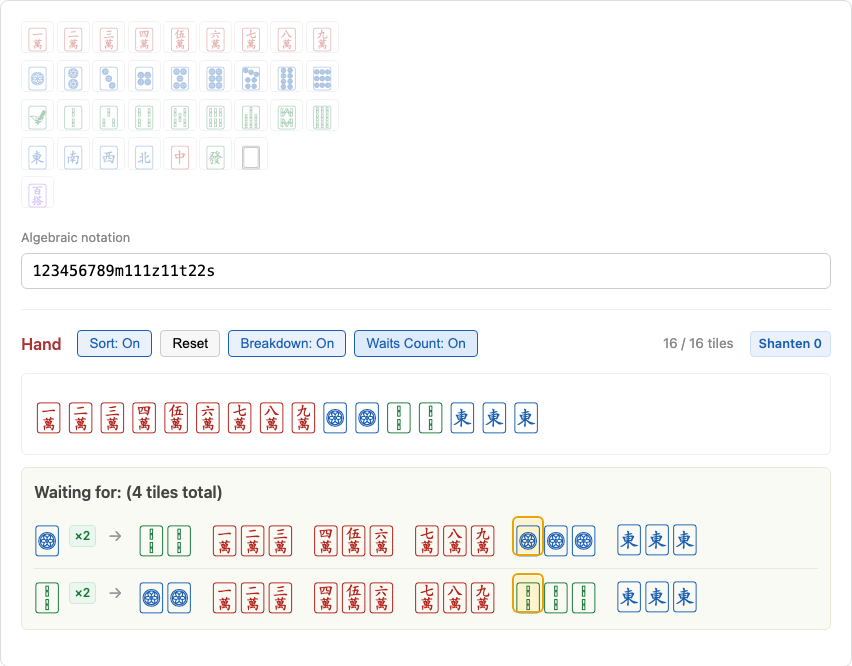
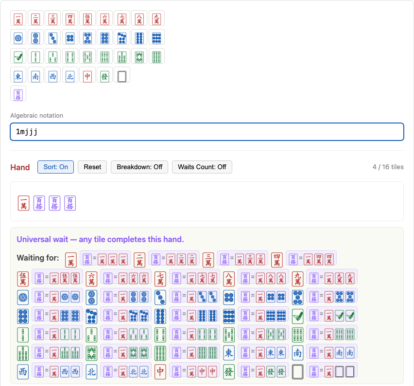
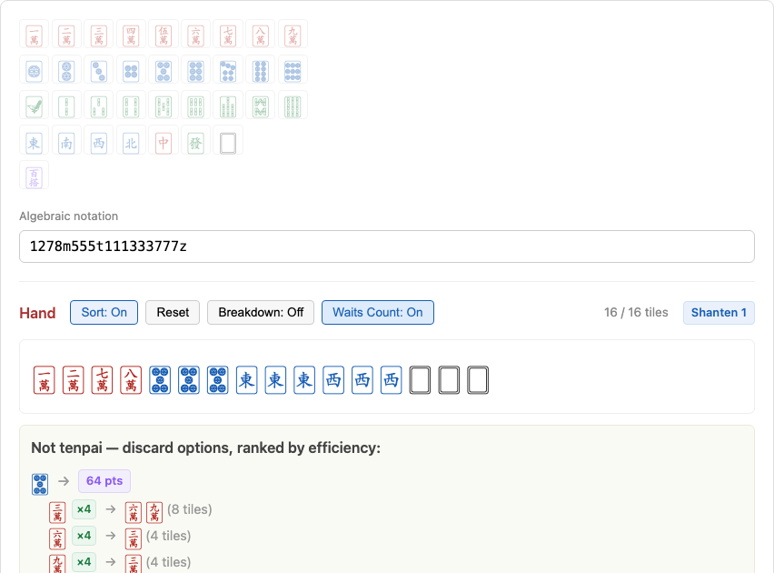
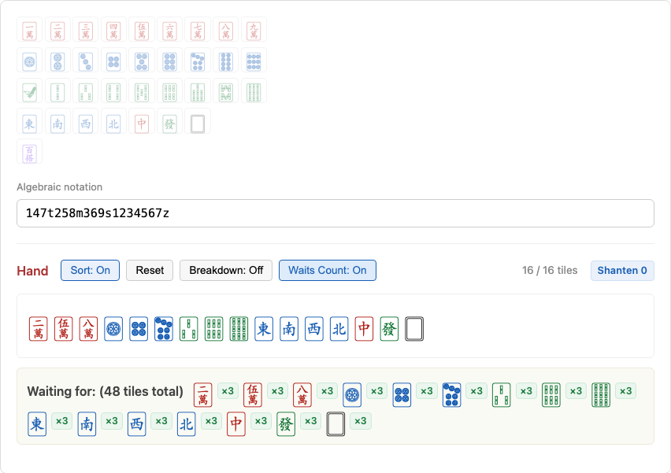

# mjwaits

A waits calculator for Taiwanese (16-tile) Mahjong. Build a hand, and it tells you what you're waiting on, how close you are, and which discard gives you the best odds of getting there.

**Live app: [app.kevinlhc.com/mjwaits](https://app.kevinlhc.com/mjwaits/)**



## Features

### Hand input

- **Tap tiles** on the picker, or **type algebraic notation** directly (e.g. `123456789m111z11t22s`) — the two stay in sync.
- Suits: `m` (man/characters), `t` (pin/circles), `s` (sou/bamboo), `z` (honors, 1–7 for East/South/West/North/Red/Green/White), `j` (joker).
- **Sort mode** toggle: on, new tiles are kept in sorted order as you add them; off, they stay exactly in the order you entered them — and toggling back off reverts to that original order.
- A 4-copies-per-kind cap is enforced automatically (jokers excluded — see below).

### Waits

- Enter a hand at any checkpoint size (1, 4, 7, 10, 13, 16 tiles) to see what completes it.
- **Universal wait** is flagged explicitly when literally any of the 34 tile kinds would complete the hand.
- **Waits Count** toggle: shows how many copies of each waiting tile are still available (4 minus what's already in your hand), plus a running total across all waits.
- **Breakdown mode** (off / on / sorted): shows the exact meld/pair decomposition for each wait, with the completing tile highlighted. "Sorted" keeps melds in tile order instead of always listing the pair first.

### Jokers (🀪)

Jokers are wildcards standing in for any tile. Add any number of them to a hand and the calculator works out every wait they unlock, along with what each joker resolves to for a given wait — using a wildcard-budget search rather than brute-forcing every possible substitution, so it stays fast even with many jokers in hand.



### Shanten

A full numeric shanten calculator (not just tenpai/not-tenpai) — the minimum number of discard+draw exchanges needed to reach tenpai. Covers the standard meld+pair shape plus the special hands below.

### Discard efficiency calculator

When a 16-tile hand isn't tenpai, the app suggests discards and shows a two-step lookahead for each one: for every useful draw, how many copies of that tile remain, and what the hand would then be waiting on (with its own remaining count). Discards are ranked by a weighted score combining both, so you can see which discard actually gives the best odds of reaching a win — not just which one reaches tenpai fastest.



### Special hands

Beyond the standard 5-melds-plus-a-pair shape, the calculator recognizes:

- **Thirteen Orphans** — all 13 terminal/honor kinds, one doubled as the pair, plus one ordinary meld.
- **Eight Pairs ("Liguligu")** — seven pairs plus one tripled pair (a full quad also counts as two pairs).
- **Sixteen Unrelated Tiles** — all 7 honors plus 3 mutually "unrelated" ranks from each of man/pin/sou (no two close enough to ever share a chow), plus one tile doubling any of them for the pair.



## Notation reference

```
123456789m111z11t22s   5 melds + a pair
1278m555t111333777z    mixed suits and honors
jjjj                    4 jokers, no rank needed
```

Digits before a suit letter are that many tiles of that suit; jokers are written as a run of bare `j` characters since they have no rank.

## Development

```bash
npm install
npm run dev      # start the dev server
npm test         # run the test suite (vitest)
npm run build    # typecheck + production build
```

The core engine (parsing, shanten, waits, joker resolution, discard analysis) lives in [`src/lib/mahjong.ts`](src/lib/mahjong.ts) and is covered by an extensive test suite in [`src/lib/mahjong.test.ts`](src/lib/mahjong.test.ts), including brute-force cross-validation for the trickier joker and shanten logic.

Built with React, TypeScript, and Vite; deployed to GitHub Pages via GitHub Actions on every push to `main`.
